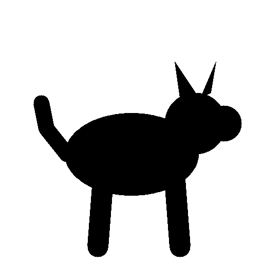
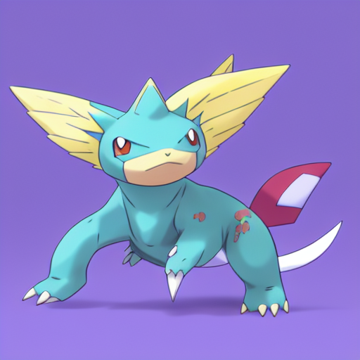
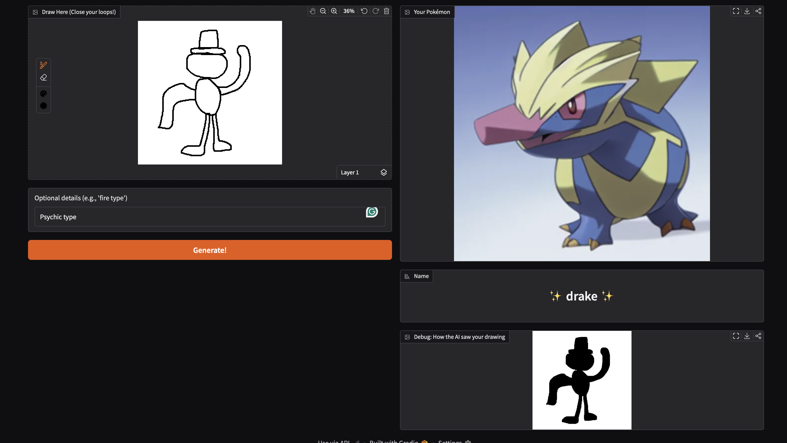

# Who's That Diffusion? 🐍⚡️
**An End-to-End Generative AI Pipeline for Pokémon Creation**

**Who's That Diffusion?** is a custom AI pipeline that turns simple black-and-white shapes into high-quality, Ken Sugimori-style Pokémon artwork. It doesn't just draw them—it creates a cohesive identity by using a Vision-Language chain to analyze the creature and invent a unique name for it.

### 🎨 The Results
*From a simple silhouette to "Ariel" — fully generated and named by AI.*

<p align="center">
  
  
</p>

---

## 🚀 Features

* **Sketch-to-Pokémon:** Uses a fine-tuned **ControlNet** adapter to force Stable Diffusion to strictly respect the geometry of user drawings.
* **Ken Sugimori Style:** Trained on a dataset of official Gen 1 & 2 artwork to replicate the distinct watercolor and shading style of the original games.
* **Auto-Naming Engine:** Integrated **BLIP** (Vision) and **Flan-T5** (Language) models. The system "looks" at the generated image, describes its features (e.g., "red tail, wings"), and hallucinates a fitting fantasy name.
* **Apple Silicon Optimized:** Fully optimized training and inference pipeline for Mac (M1/M2/M3) using `MPS` acceleration and CPU fallbacks for unsupported operations.
* **Interactive Web UI:** A Gradio-based frontend where users can draw, generate, and name creatures in real-time.

---

## 🛠️ The Architecture

This project is a "Full Stack" Generative AI solution:

1.  **Data Engineering:** Custom processing of image pairs (RGB Art + Binary Silhouettes).
2.  **Model Training:** Fine-tuned a ControlNet adapter on Stable Diffusion v1.5 for **500 steps** using Hugging Face `accelerate`.
3.  **Inference Pipeline:**
    * **Input:** User draws a sketch in the UI.
    * **Processing:** Sketch is converted to a binary mask using OpenCV.
    * **Generation:** ControlNet guides the diffusion process.
4.  **NLP Post-Processing:** The generated image is passed to a VQA (Visual Question Answering) chain to generate a name based on visual traits.

### 🖥️ The Interface
*Users can draw shapes directly in the browser to generate creatures.*



---

## ⚙️ Installation

1.  **Clone the repository**
    ```bash
    git clone [https://github.com/yourusername/whos-that-diffusion.git](https://github.com/yourusername/whos-that-diffusion.git)
    cd whos-that-diffusion
    ```

2.  **Install Dependencies**
    ```bash
    pip install -r requirements.txt
    ```
    *(Note: Requires `torch`, `diffusers`, `transformers`, `accelerate`, `gradio`, `opencv-python`, and `safetensors`)*

---

## 🏎️ Quick Start: Run the Pipeline

Since the repository does not include the large model weights, you will need to train the model yourself. Follow these steps to build the pipeline from scratch:

### 1. Build the Dataset
Format the raw images into the structure required by Hugging Face Datasets.
```bash
python build_controlnet_data.py
```
### 2. Train the Model

Fine-tune the ControlNet adapter. On an M1/M2 Mac, this takes approximately 45-60 minutes for 500 steps.

```bash
./train_cnet.sh
```

This will create a controlnet_output folder containing your custom model weights.

### 3. Launch the App

Start the interactive drawing tool. We use a fallback flag to ensure compatibility with Mac MPS acceleration.

```bash
PYTORCH_ENABLE_MPS_FALLBACK=1 python app.py
```

Open the link (usually http://127.0.0.1:7860) in your browser.

## 🧠 Training Details
* **Base Model:** runwayml/stable-diffusion-v1-5
* **Hardware:** Trained locally on Apple Silicon (Mac MPS).
* **Steps:** 500 steps (Proof of Concept).
* **Dataset:** Custom dataset of Pokémon silhouettes paired with official artwork.

## 📝 License
This project is for educational and research purposes. Pokémon is a trademark of Nintendo/Creatures Inc./GAME FREAK inc.
